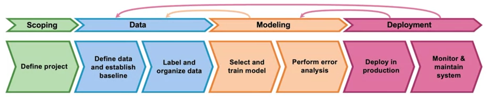

# Machine Learning Workflow and Resources

Machine learning projects follow a structured workflow that spans the entire lifecycle, from defining project goals to deploying and maintaining the final system. This workflow can be broadly divided into four interconnected stages: **Scoping**, where project objectives and constraints are defined; **Data**, where data is prepared and organized; **Modeling**, where algorithms are used to train models; and **Deployment**, where models are integrated into production systems and monitored for continued success. 

Figure 1 provides an overview of this workflow, highlighting the key steps within each stage.

*Figure 1: Overview of the machine learning workflow: Scoping, Data, Modeling, and Deployment. While these steps are generally carried out sequentially, iterative refinement is often required to optimize outcomes.*

**[Here](https://drive.google.com/file/d/1ezX-GPt9SuKM9eFd_8uRn3ZZ4YlGDszC/view?usp=drive_link)** 
you find an ebook, that covers all 4 stages of the machine learning workflow 
and provides guidelines for decision making in every stage.

### **Differences Between Real-World Projects and Data Science Challenges**
While this structured workflow is essential for real-world machine learning 
projects in companies, data science challenges are a bit different. In 
challenges, the **Scoping** and **Deployment** phases are typically **absent**.
The focus is solely on **Data** (preparation, feature engineering, and cleaning)
and **Modeling** (training and evaluating models). 

## **Data**
Properly handling data is a crucial step in any machine learning project. The following resources can help with key aspects of data preparation and analysis.

### **Exploratory Data Analysis (EDA)**
EDA is the first step in understanding a dataset, detecting patterns, and identifying potential issues. Below are some useful Python packages for automating EDA:

- **[ydata-profiling](https://github.com/ydataai/ydata-profiling)**: Successor to pandas-profiling, optimized for performance and additional insights.
- **[sweetviz](https://github.com/fbdesignpro/sweetviz)**: Creates interactive visualizations comparing datasets or target variable distributions.
- **[dtale](https://github.com/man-group/dtale)**: Provides an interactive interface for exploring Pandas DataFrames.
- **[AutoViz](https://github.com/AutoViML/AutoViz)**: Automatically generates plots to summarize datasets.

### **Data Cleaning**
Before modeling, data must be cleaned to ensure quality and reliability. Common tasks include:

- **Handling Missing Values**  
  - Impute missing values using **mean, median, mode, or predictive models**.  
  - Use libraries like **[Missingno](https://github.com/ResidentMario/missingno)** for visualizing missing data patterns.  
  - Drop missing values if they are **insignificant or uninformative**.

- **Outlier Detection & Removal**  
  - Identify outliers using **Z-score, IQR, or isolation forests**.  
  - Consider whether outliers are **valid extreme cases or data errors**.  
  - Use **[PyOD](https://github.com/yzhao062/pyod)** for automated outlier detection.

- **Correcting Nonsensical Data**  
  - Detect and remove logically **impossible** records (e.g., an apartment on the 7th floor when the building only has 5 floors).  
  - Use domain knowledge to apply **custom validation rules**.

- **Standardizing Data Formats**  
  - Convert inconsistent **date formats, units, and categorical labels**.  
  - Use **[pandas](https://pandas.pydata.org/)** functions like `str.lower()`, `pd.to_datetime()`, and `.replace()` for cleaning.

## **Modeling**
Modeling involves selecting algorithms, training models, and tuning 
hyperparameters to optimize performance. The following resources are useful for
different aspects of model training:

### **Popular Machine Learning Frameworks**
- **[Scikit-Learn](https://scikit-learn.org/)** – The most widely used Python library for classical machine learning, including regression, classification, clustering, and feature selection.
- **[XGBoost](https://github.com/dmlc/xgboost)** – A high-performance gradient boosting library, commonly used in data science competitions due to its efficiency and predictive power.
- **[LightGBM](https://github.com/microsoft/LightGBM)** – A fast, memory-efficient gradient boosting framework developed by Microsoft, optimized for large datasets.
- **[CatBoost](https://github.com/catboost/catboost)** – A gradient boosting library from Yandex that handles categorical data efficiently without needing extensive preprocessing.

### **Automated Machine Learning (AutoML)**
- **[PyCaret](https://github.com/pycaret/pycaret)** – A low-code AutoML library that automates model selection, hyperparameter tuning, and feature engineering.
- **[H2O.ai](https://github.com/h2oai/h2o-3)** – An open-source AutoML platform supporting deep learning, gradient boosting, and ensemble methods.
- **[Auto-sklearn](https://github.com/automl/auto-sklearn)** – A drop-in replacement for Scikit-Learn that automates model selection and hyperparameter tuning.
- **[MLJAR AutoML](https://github.com/mljar/mljar-supervised)** – An AutoML tool that performs model selection, feature engineering, and hyperparameter optimization with extensive reports.

### **Hyperparameter Optimization**
- **[Optuna](https://github.com/optuna/optuna)** – A flexible hyperparameter optimization framework that supports Bayesian optimization and pruning.
- **[Hyperopt](https://github.com/hyperopt/hyperopt)** – A widely used library for automated hyperparameter tuning using Tree-structured Parzen Estimators (TPE).
- **[Ray Tune](https://github.com/ray-project/ray/tree/master/python/ray/tune)** – A scalable hyperparameter tuning framework that integrates with PyTorch, TensorFlow, and XGBoost.

### **Deep Learning Frameworks**
- **[TensorFlow](https://github.com/tensorflow/tensorflow)** – Google's deep learning framework supporting neural networks and large-scale machine learning applications.
- **[PyTorch](https://github.com/pytorch/pytorch)** – A flexible and widely used deep learning library developed by Facebook, known for its dynamic computation graph and ease of use.
- **[Keras](https://github.com/keras-team/keras)** – A high-level API for building neural networks, now integrated with TensorFlow.

